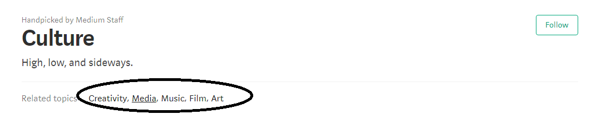
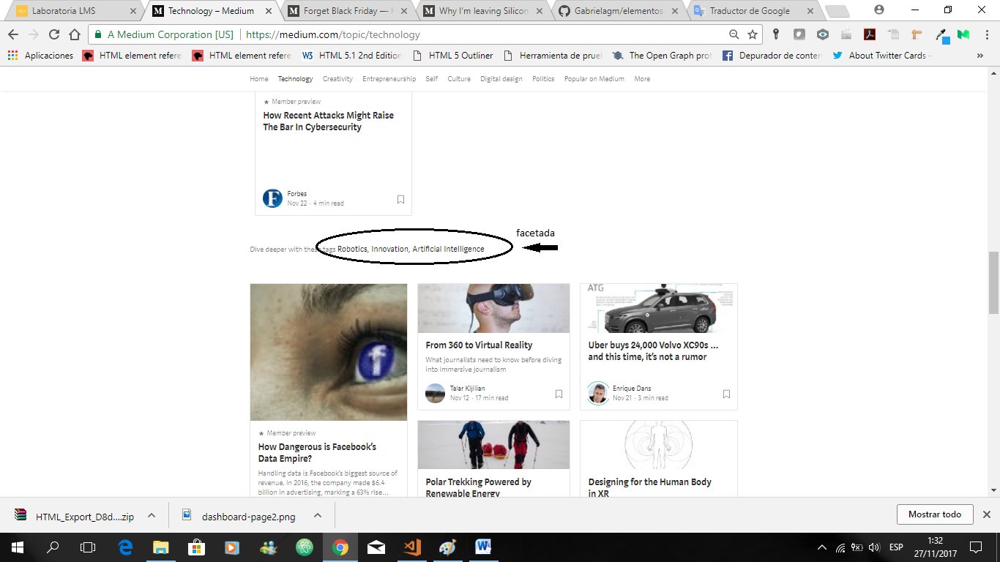
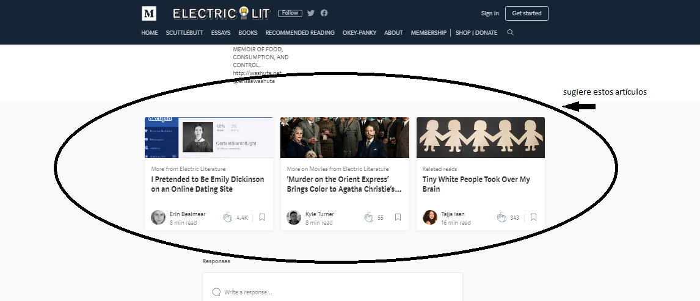
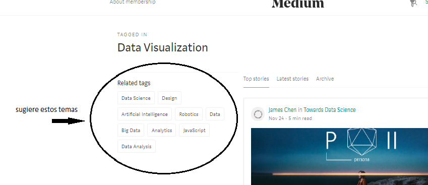
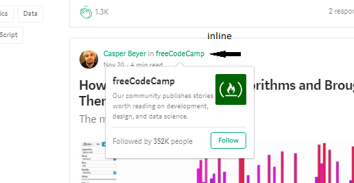
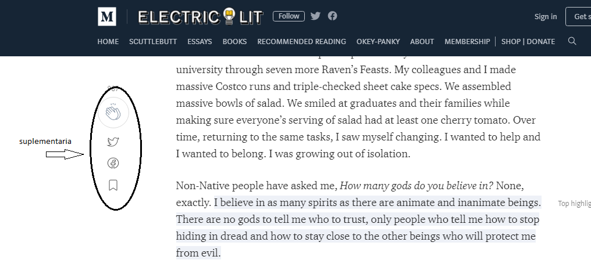
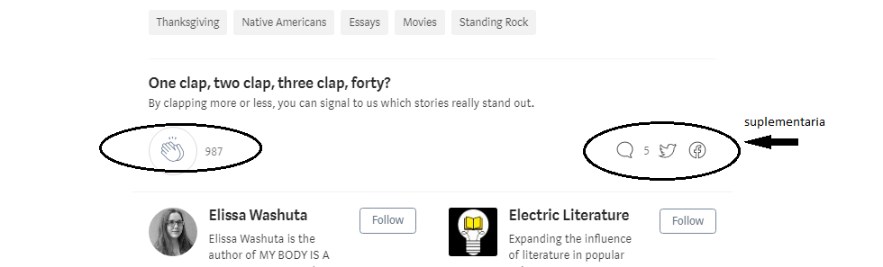

# Elementos de Navegación

## Objetivo

Identificar los elementos de navegación en los siguientes sites:

* Breather
* Github
* Medium

## Resolución 

Analizando la web de Medium:

***Navegación Global***

***Navegación Local***

***Navegación Facetada***

***Navegación Contextual***

***Navegación Inline***

***Navegación Suplementaria***

